# NFDI4Objects Property Graph

Dieses Repositoriy enthält Skripte und Dokumentation zur Erstellung und
Management eine Knowledge Graphen der von NFDI4Objects TA5 als Property-Graph
umgesetzt wird.

*WORK IN PROGRESS*

## Technische Voraussetzungen

- Unix-Shell und Standard-Tools
- Docker
- [pgraphs](https://www.npmjs.com/package/pgraphs)
- [mermaid-cli](https://www.npmjs.com/package/@mermaid-js/mermaid-cli)

## Datenfluss

## Datenmodell

Als Sammlungsübergeifendes Datenmodell wird CIDOC-CRM verwendet.

- Knoten erhalten als Knoten-Label die entsprechenden CRM-Klassen. Dabei werden
  Leerzeichen und Sonderzeichen durch Unterstrich ersetzt, also z.B.
  `E22_Human_Made_Object` für
  [E22 Human-Made Object](https://cidoc-crm.org/html/cidoc_crm_v7.1.3_with_translations.html#E22).
 
- Zwischenzeitlich gelöschte und umbenannte Klassen können weiterhin verwendet werden, allerdings
  werden diese durch [Expansion](#expansion) auf die neueste Form gemappt.

## Expansion

Da Property-Graphen im Gegensatz zu RDF keine Inferenz-Regeln beinhalten und
weil Inferenz-Regeln sowieso umständlich sind, werden die Daten im Property-Graphen
*expandiert*. Dabei werden Knoten mit *zusätzlichen* Labels angereichert, z.B.

- `E22_Man_Made_Object` => `E22_Human_Made_Object` (renamedTo)
- `E50_Date` => `E41_Appellation` (replacedBy)
- `E7_Activity`=> `E5_Event` (superClass)

Ein eigener Property-Graph mit dem gesamten CIDOC-CRM Datenmodell befindet sich dazu
in Vorbereitung.

Die Expansion von zusätzlichen Klassen der [NFDI4Objects Core
Ontology](https://github.com/nfdi4objects/n4o-core-ontology) auf CIDOC-CRM ist
auf die gleiche Weise möglich.

