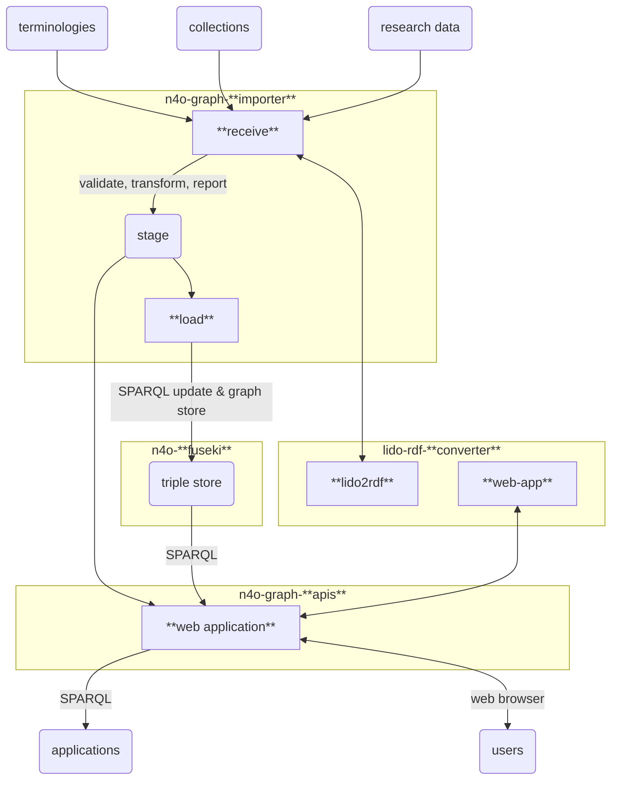

# NFDI4Objects Graph

> Technical architecture and documentation of the NFDI4Objects Knowledge Graph

## Components

- [n4o-fuseki](https://github.com/nfdi4objects/n4o-fuseki): RDF triple store
- [n4o-graph-apis](https://github.com/nfdi4objects/n4o-graph-apis): web interface and public SPARQL endpoint
- [n4o-graph-importer](https://github.com/nfdi4objects/n4o-graph-importer): scripts to import data into the triple store
- [lido-rdf-converter](https://github.com/nfdi4objects/lido-rdf-converter): convert LIDO format to RDF

## Data flow

## Installation

Clone this repository or copy file [`docker-compose.yml`](docker-compose.yml) and config file [`config-apis.yml`](config-apis.yml) to a local directory. Then start a new set of docker containers that make the N4O Knowledge Graph:

~~~sh
docker compose up --force-recreate --remove-orphans -V
~~~

To update the Docker images run

~~~sh
docker compose pull
~~~

## Usage

The web interface is made public at <http://localhost:8000/> by default. The tool to convert LIDO to RDF is hosted at <http://localhost:8000/lido2rdf/>.

The importer scripts can be called with `docker compose run importer`:

First retrieve the current list of terminologies and their metadata:

~~~sh
docker compose run importer update-terminologies
docker compose run importer load-terminologies-metadata 
~~~

The terminology metadata should now be listed at <http://localhost:8000/terminology/>.

Then retrieve and load selected terminologies, e.g.:

~~~sh
docker compose run importer import-terminology http://bartoc.org/en/node/18274  # SKOS
docker compose run importer import-terminology http://bartoc.org/en/node/1644   # CRM
~~~

*...import of collections still being worked on...*

## Configuration

The following environment variables can be used for configuration:

- PORT
- STAGE
- DATA

## License

The content of this repository can be used freely as *Public Domain* ([CC Zero](https://creativecommons.org/publicdomain/zero/1.0/)).
