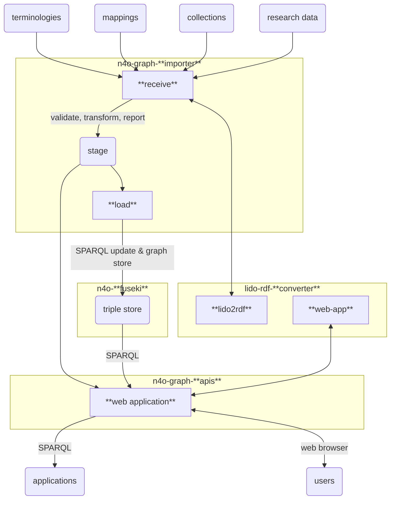

# NFDI4Objects Graph

> Technical architecture and documentation of the NFDI4Objects Knowledge Graph

## Components

- [n4o-fuseki](https://github.com/nfdi4objects/n4o-fuseki): RDF triple store
- [n4o-graph-apis](https://github.com/nfdi4objects/n4o-graph-apis): web interface and public SPARQL endpoint
- [n4o-graph-importer](https://github.com/nfdi4objects/n4o-graph-importer): scripts to import data into the triple store
- [lido-rdf-converter](https://github.com/nfdi4objects/lido-rdf-converter): convert LIDO format to RDF

Another component is planned to provide an admin interface.

## Data flow

## Installation

Clone this repository or copy file [`docker-compose.yml`](docker-compose.yml) and config file [`config-apis.yml`](config-apis.yml) to a local directory. Then start a new set of docker containers that make the N4O Knowledge Graph:

~~~sh
docker compose up --force-recreate --remove-orphans -V
~~~

To update the locally cached Docker images, first run:

~~~sh
docker compose pull
~~~

## Usage

The web interface is made public at <http://localhost:8000/> by default.

For importing data see n4o-graph-importer.

## Configuration

The following environment variables can be used for configuration:

- PORT - port to publish n4o-graph-apis (public read access)
- IMPORT - port to publish n4o-graph-importer (with write access!)
- STAGE - stage directory (default: `./stage`)
- DATA - data directory (optional, default: `./data`)

## License

The content of this repository can be used freely as *Public Domain* ([CC Zero](https://creativecommons.org/publicdomain/zero/1.0/)).
